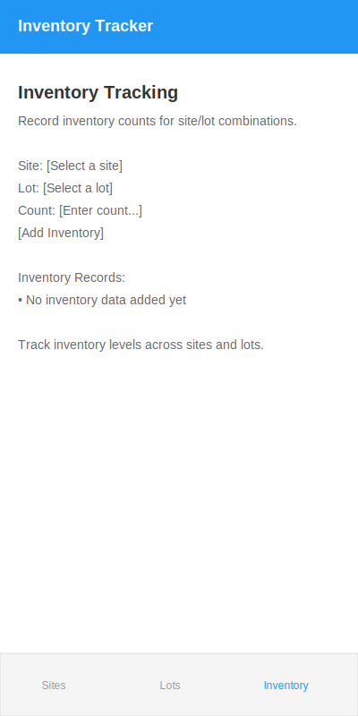

# Inventory Tracker

A Flutter-based inventory management application that helps you track inventory across different sites and lots.

## Screenshots

Here are the main screens of the Inventory Tracker application:

### Sites Management
Manage your site locations where inventory is stored.

| Empty State | With Data |
|-------------|-----------|
|  |  |

### Lots Management
Create and manage inventory lot numbers for organizing inventory batches.

| Empty State | With Data |
|-------------|-----------|
|  |  |

### Inventory Tracking
Record and track inventory counts for specific site and lot combinations.

| Empty State | With Data |
|-------------|-----------|
|  |  |

## Features

- **Site Management**: Create, edit, and delete site locations
- **Lot Management**: Create, edit, and delete inventory lots
- **Inventory Tracking**: Record inventory counts for specific site/lot combinations
- **Tabbed Interface**: Easy navigation between different views
- **SQLite Database**: Persistent storage with Drift ORM

## Technical Details

This app is built using:

- **Flutter**: Cross-platform UI framework
- **Drift**: SQLite ORM for Flutter/Dart
- **SQLite**: Local database storage

## Database Schema

The app uses the following data model:

1. **Sites**
   - ID (Primary Key)
   - Site Name

2. **Lots**
   - ID (Primary Key)
   - Lot Number

3. **InventorySnapshots**
   - ID (Primary Key)
   - Site ID (Foreign Key)
   - Lot ID (Foreign Key)
   - Count
   - Timestamp

## Getting Started

1. Clone this repository
2. Run `flutter pub get` to install dependencies
3. Run `flutter pub run build_runner build` to generate Drift database code
4. Run `flutter run` to start the application

## Usage

1. First, add sites in the "Sites" tab
2. Add lots in the "Lots" tab
3. In the "Inventory" tab, select a site and lot, enter a count, and add inventory data
4. View, edit, or delete your inventory records as needed
